<!-- README.md is generated from README.Rmd. Please edit that file -->
ggptt
=====

A collection of ggplot2 themes and functions for use in [PTT](http://www.ptt.fi/).

installation
------------

Install from github:

``` r

# install.packages("devtools")
devtools::install_github("pttry/ggptt")
```

Introduction to ggptt
=====================

Prepartions for introduction:

``` r

# Install and load packages

# install.packages(c("ggptt", "dplyr", "tidyr", "scales"))

library(ggptt)
library(dplyr)


# Clear possible settings
unset_ptt()

# data for examples
pdat <- economics %>% 
  select(date, psavert, uempmed) %>% 
  tidyr::gather(vars, values, -date)
  
```

`ggptt` will also load `ggplot2`.

PTT colours
-----------

### PTT colours: `ptt_pal()`

``` r
scales::show_col(ptt_pal(6))
```

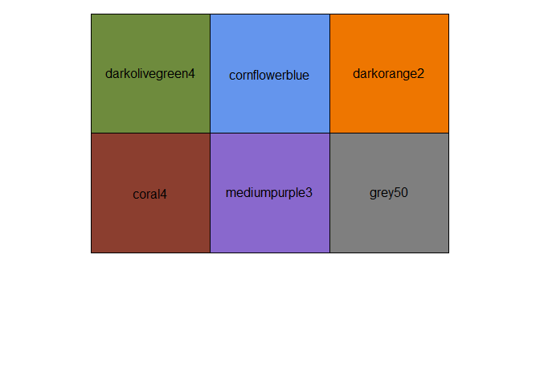

### VNK: `vnk_pal()`

``` r
scales::show_col(vnk_pal(4))
```

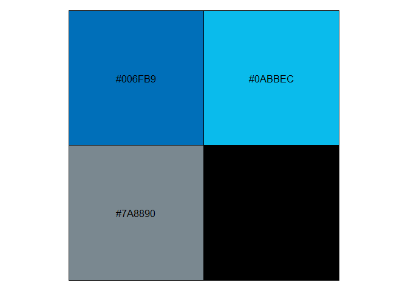

PTT scales
----------

`scale_colour_ptt()` and `scale_fill_ptt()`

``` r

p <- ggplot(pdat, aes(x = date, y = values, colour = vars)) + 
  geom_line()

p
```

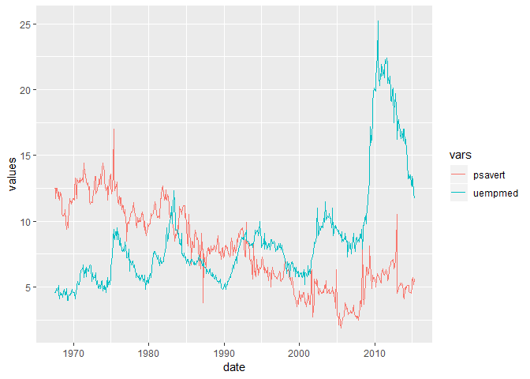

``` r

p + scale_colour_ptt()
```

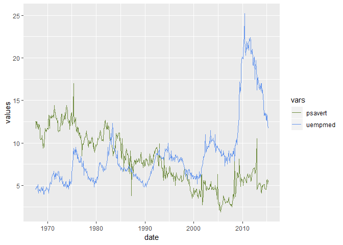

PTT theme
---------

``` r

p + theme_ptt()
```

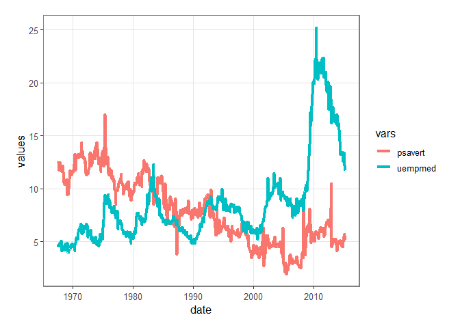

`set_ptt()` sets PTT theme and colours. `unset_ptt()` could be used to undo ggptt settings.

``` r

set_ptt()
p
```


Also `theme_map()` for maps.

"the"-theme elemets
-------------------

``` r

p + the_legend_bot()
```

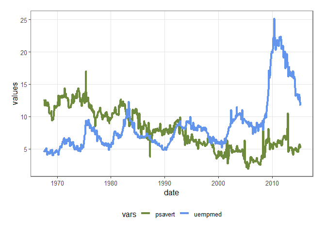

``` r

p + the_title_blank()
```

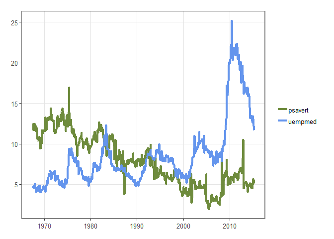

``` r

p + the_title_blank(c("x", "l"))
```

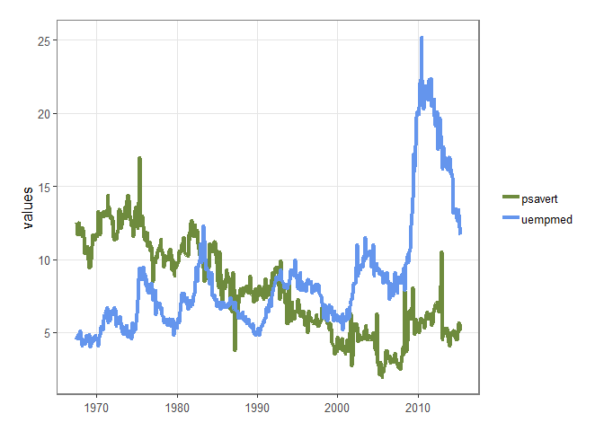

``` r

p + the_x45()
```

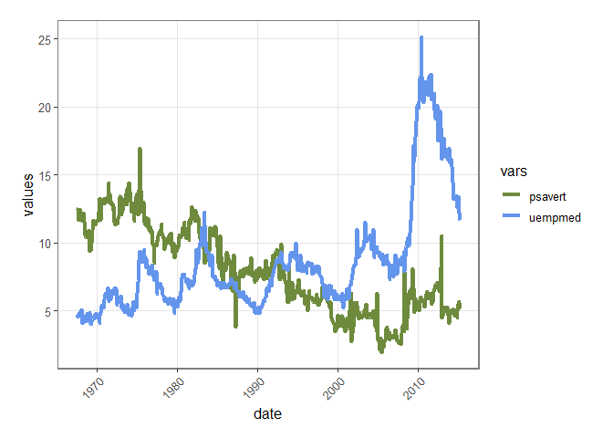

scale formaters
---------------

``` r

p + scale_x_date(labels = no_century)
```


``` r

# Percents
pdat2 <- pdat %>% mutate(values = values/100)
p %+% pdat2 + scale_y_continuous(labels = percent_comma)
```


``` r

# comma
p %+% pdat2 + scale_y_continuous(labels = deci_comma)
```

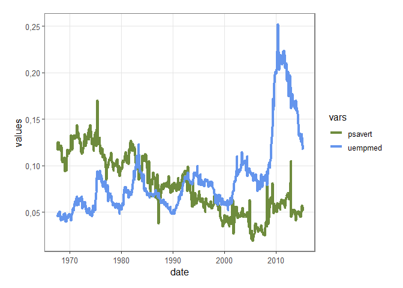

Extra geoms
-----------

### Horizontal 0-line

``` r

p + geom_h0()
```

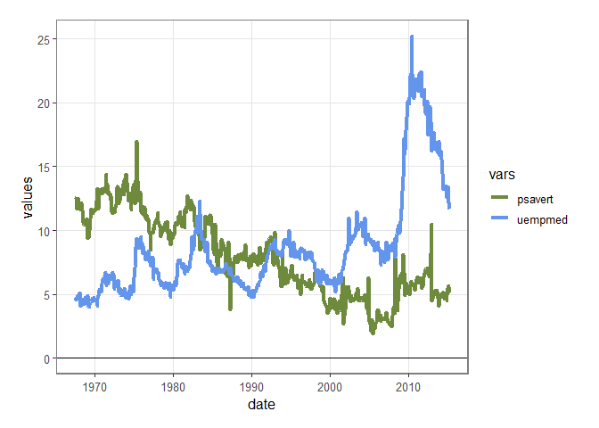

Share a legend
--------------

``` r

grid_arrange_shared_legend(p, p + geom_h0(), ncol = 2)
```

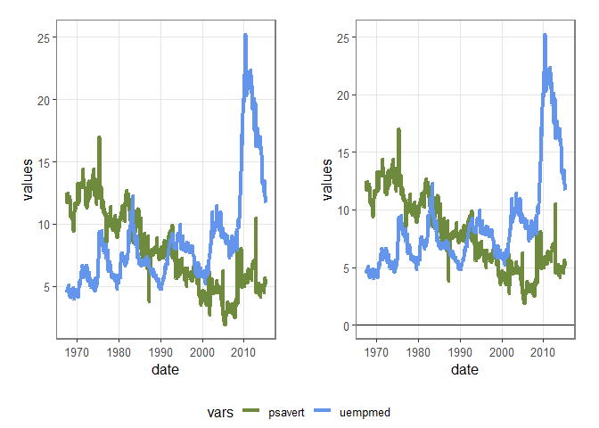

Add extra breaks to a continuous scale
--------------------------------------

``` r

p + scale_y_continuous(breaks = extra_breaks(17))
```


